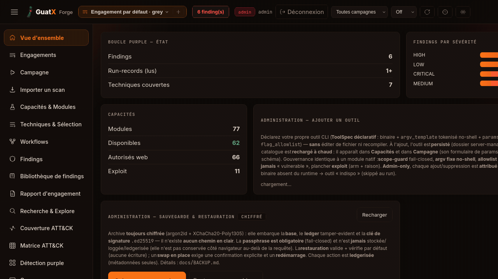

<div align="center">

# 🔨 Forge

**The heavyweight red-team engine.** — l'antithèse offensive de [Plume](https://github.com/guatxlabs/plume), le SOC blue-team.
*Python · stdlib-only core · sûreté d'abord (ROE fail-closed + ledger tamper-evident).*

**·  by [GuatX](https://guatx.com)  ·  usage autorisé uniquement  ·**

**License: [AGPL-3.0-or-later](LICENSE) — 100 % open source**  ·  Modules avancés (flag-gated, OFF par défaut) → [`ADVANCED_MODULES.md`](docs/ADVANCED_MODULES.md)

<br>



<sub>Console Forge — dashboard · catalogue de modules (les **exploit/destructif** sont gatés par les ROE) · findings mappés **ATT&CK** · **lancement gouverné** (hors-scope = VETO dur, chaque tir au **ledger**). Le registre compte **88 modules** — compte MESURÉ par `python3 -m forge.cli modules --json`, pas lu sur cette capture.</sub>

</div>

Plume **observe** (la plume qui consigne, bleu). Forge **frappe** — et **trempe** les défenses de
Plume (la boucle purple-team). Forge orchestre des modules d'attaque (recon → enum → exploit) où
**chaque action passe par une gate ROE fail-closed** et est tracée dans un **ledger d'engagement
append-time, tamper-evident**. Par défaut, Forge est **INERTE** : rien ne peut tirer tant que
l'opérateur n'a pas armé chaque couche consciemment.

> ⚠️ **Cadre autorisé uniquement** (bug bounty in-scope, pentest sous contrat, CTF, infra propre).
> La gate ROE + le scope-guard + le ledger sont là pour **imposer ET prouver** l'autorisation.
> Passer un WAF/Cloudflare ≠ une faille : c'est un enabler d'accès, pas un bug.

> 📚 **Documentation produit complète → [`docs/`](docs/README.md)** — vue d'ensemble, architecture,
> installation, wizard de 1er déploiement, référence de configuration (env + settings), administration,
> concepts, référence CLI & API HTTP, standalone, modèle de sécurité, désinstallation, dépannage.

## Sûreté d'abord — la gate à 4 couches (`forge/roe.py`)

Toutes doivent être franchies pour qu'une action LIVE parte. Sinon : `DRY_RUN` (simulation) ou
`VETO` (refus dur).

| Couche | Question | Échec → |
|---|---|---|
| 1 — armé ? | engagement explicitement armé (`--arm`) ? | `DRY_RUN` |
| 2 — scope ? | cible ∈ `in_scope` et ∉ `out_scope` ? (**fail-closed** : `in_scope` vide = rien) | `VETO` |
| 3 — capacité ? | exploit/destructif ⇒ `allow_exploit`/`allow_destructive` explicites ? | `VETO` |
| 4 — approuvé ? | action approuvée (`--approve`), ou mode `auto` ? | `DRY_RUN` |

`VETO` (couche 2/3) n'est **jamais** simulé ni tiré. Toute erreur d'évaluation ⇒ `VETO` (fail-closed).

## Install

```sh
pip install -e .          # met l'exécutable `forge` sur le PATH (forge = forge.cli:main)
forge doctor              # diagnostic : modules opérationnels + outil/service attendu par module
```

Sans installation, tout est aussi accessible via `python3 -m forge.cli <commande>`.

## Quickstart

> 🚀 **Nouveau ?** Le parcours opérateur bout-en-bout **100 % hors-ligne** (seed + mock-Plume, aucun
> service externe) est dans [`docs/GETTING_STARTED.md`](docs/GETTING_STARTED.md) — install → scope →
> campagne/`make demo` → console → matrice purple → rapport → vérif intégrité, avec un point de
> contrôle « ce que tu dois voir » à chaque étape.

```sh
# démonstration bout-en-bout — AUCUNE cible réelle, AUCUN I/O réseau
forge demo                                  # ou: python3 -m forge.cli demo

# suite complète (stdlib, zéro réseau) : Python unittest + cargo test de la console
make test                                   # = python3 -m unittest discover -s tests -t . + (cd console && cargo test)
python3 -m unittest discover -s tests -t .  # Python seul (2834 tests — compte MESURÉ : `Ran 2834 tests` / `OK (skipped=3)`)

# vérifier l'appartenance d'une cible
forge scope-check app.exemple.test --scope scope.json

# planifier (montre le verdict ROE de chaque action, ne tire rien)
forge plan --scope scope.json --actions actions.json

# exécuter — INERTE par défaut ; il faut armer ET approuver pour tirer
forge run --scope scope.json --actions actions.json \
    --ledger engagements/e1.jsonl --report rapport.md            # tout en DRY_RUN
forge run --scope scope.json --actions actions.json \
    --arm --approve demo.fingerprint:app.test --ledger engagements/e1.jsonl

# intégrité de l'engagement
forge ledger verify --ledger engagements/e1.jsonl
```

Copier `scope.example.json` → `scope.json` et renseigner `in_scope` **avec autorisation écrite**.
`scope.json`, `*.key`, `*.jsonl` sont gitignorés (secrets / état d'engagement).

### Démo instantanée — console peuplée en 1 commande (hors-ligne)

Un **engagement de référence synthétique** est fourni dans
[`examples/reference-engagement/`](examples/reference-engagement/) (hôtes `.example` réservés, IP de
doc — **aucune cible réelle, aucun SOC réel**). Il peuple immédiatement les onglets
Findings / Coverage / Purple / Runs :

```sh
make demo          # amorce la base démo + lance la console peuplée  -> http://127.0.0.1:7100
make demo-purple   # idem + stub mock-Plume (DEMO FIXTURE) -> matrice détecté/raté/MTTD (7 tirés, 4 détectés, 3 ratés)
```

`make demo` lance `forge seed-demo --dir examples/reference-engagement`, qui **ingère les
fixtures directement dans SQLite** (idempotent, sans réseau, ne touche que la campagne démo
`acme-lab`). Le write-up commercial correspondant :
[`examples/reference-engagement/REFERENCE_ENGAGEMENT.md`](examples/reference-engagement/REFERENCE_ENGAGEMENT.md).

## Console Rust (`console/` — le store + la boucle purple)

Fork minimal de la colonne Plume (axum + rusqlite, binaire unique) : store du modèle ROUGE
(`finding`/`runrecord`), API, et le **point de jonction purple** (`POST /api/ingest` reçoit les
findings + run-records ATT&CK du moteur Python ; Plume corrèle ensuite par champ `mitre`).

```sh
cd console && cargo build --release            # compile offline depuis le cache cargo
# (optionnel) activer l'auth opérateur : hash argon2id du mot de passe, jamais en clair
HASH=$(./target/release/forge hashpw 'mon-mot-de-passe')
FORGE_CONSOLE_TOKEN=$(openssl rand -hex 16) \
FORGE_CONSOLE_USER=forge FORGE_CONSOLE_PASS_HASH="$HASH" \
    ./target/release/forge            # http://127.0.0.1:7100  (sans PASS_HASH = dev localhost ouvert)
# côté moteur : expédier une campagne vers la console
python3 -m forge.cli campaign --scope scope.json --targets t.json --campaign op1 \
    --console http://127.0.0.1:7100 --console-token "$FORGE_CONSOLE_TOKEN"
```

**Auth/RBAC** (modèle `auth_guard`/`host_guard` de Plume) : `/health` ouvert ; toutes les autres
routes derrière (a) **host-guard** anti-DNS-rebinding (`Host` en allowlist → sinon `421`) et (b)
**auth-guard** si `FORGE_CONSOLE_PASS_HASH` est défini — **Basic** (opérateur=viewer, lecture) ou
**Bearer token** (agent/admin=écriture). Sans hash → mode dev localhost ouvert (les écritures
restent gatées par le token). Mot de passe **argon2id** via `forge hashpw '...'`.
Endpoints : `GET /health` · `POST /api/ingest` (token) · `GET /api/findings` · `GET /api/runrecords` ·
`GET /api/coverage` (rollup ATT&CK) · **`GET /api/query?q=...`** (GXQL) · **`/api/panels`** (GET liste ·
POST créer [token] · DELETE [token] · `GET /api/panels/:id/data`) · `GET /` (console opérateur dark,
vanilla-JS : barre de recherche GXQL + **dashboard de panels** table/bar/stat).
Dedup au niveau store (`UNIQUE(campaign,target,title)`). Bind 127.0.0.1 ; auth/RBAC complète = durcissement.

**GXQL (langage de requête type-SPL, porté de Plume)** — *GuatX Query Language*, **anciennement
« SOQL »** : même langage, même syntaxe, seul le nom change ; le drapeau CLI `--soql`, la clé JSON
`soql` et le module `guatx_core::soql` restent inchangés. Interroge `finding`/`runrecord`,
compilé en **SQL read-only** (champs en allowlist, valeurs en params liés, un seul SELECT, LIMIT
plafonné, connexion `SQLITE_OPEN_READ_ONLY`). Exemples :
```
search severity=HIGH | fields target,title,mitre
search | stats count by severity | sort -count
search title~Origine
runs | stats count by mitre
```
Un champ hors allowlist → `400` (anti-injection). Le SQL compilé est renvoyé (transparence).

### Quickstart console (≈5 min)

```sh
# 1) build du binaire (offline, depuis le cache cargo)
cd console && cargo build --release && cd ..

# 2) lancer la console (dev : localhost ouvert, écritures gatées par token)
FORGE_CONSOLE_TOKEN=$(openssl rand -hex 16) ./console/target/release/forge &
#    -> http://127.0.0.1:7100   (UI opérateur dark + API)

# 3) peupler le catalogue de modules côté UI
forge modules --json                       # liste les 77 modules du registre (kind, mitre, dispo)

# 4) ingérer une campagne de démonstration (zéro réseau, finding synthétique)
FORGE_CONSOLE_URL=http://127.0.0.1:7100 FORGE_CONSOLE_TOKEN=$FORGE_CONSOLE_TOKEN \
    python3 demo_ingest.py                 # FIRE demo.fingerprint -> POST /api/ingest
```

> En conteneur : la console bind `127.0.0.1:7100` par défaut (`FORGE_CONSOLE_ADDR`). Pour
> l'exposer, fixer `FORGE_CONSOLE_ADDR=0.0.0.0:7100`, ajouter le nom d'hôte public au host-guard
> anti-rebinding via `FORGE_CONSOLE_HOST`, **et** définir `FORGE_CONSOLE_PASS_HASH` (auth argon2id)
> — ne jamais exposer le mode dev localhost-ouvert hors de la machine.

## Connecteurs (outils de pentest standards, pilotés par Forge)

Forge n'ajoute pas de capacité offensive propre : deux connecteurs **pilotent** des outils de
pentest standards que l'opérateur exécute déjà lui-même, et **mappent** leurs résultats en
Findings derrière la même gate ROE. Tous deux sondent leur service **à fire-time** (jamais au
catalogue) et s'auto-neutralisent si le service est injoignable.

| Module | Outil piloté | Variables d'env (défauts) |
|---|---|---|
| `msf.module` | **msfrpcd** (RPC msgpack) — lance le module MSF choisi par l'opérateur ; aucun payload généré par Forge | `MSF_RPC_HOST` (127.0.0.1) · `MSF_RPC_PORT` (55553) · `MSF_RPC_USER` (msf) · `MSF_RPC_PASS` · `MSF_RPC_SSL` (true) · `MSF_RPC_TOKEN` (token permanent, optionnel) |
| `burp.scan` | **REST API Burp Suite** Pro/Enterprise — lance un scan in-scope, rapatrie les issues | `BURP_API_URL` (http://127.0.0.1:1337) · `BURP_API_KEY` |

Gouvernance : `msf.module` déclare `exploit=True` (fail-safe → l'engine exige `allow_exploit`) ;
`burp.scan` reste `exploit=False` mais émet `reported_by_tool` (jamais `vulnerable` — comme nuclei,
pas de sur-classement sans preuve d'exploitabilité). `forge doctor` indique lesquels sont joignables.

## Architecture (en bref)

```
  cerveau (planner heuristique, seam orchestrateur LLM)
        │  propose des Actions (kind, target, exploit?, destructive?)
        ▼
  Engine ──► gate ROE ──► VETO | DRY_RUN | FIRE ──► Ledger (append-time, hash-chain + HMAC)
        │                                  │
        │                                  ▼ (FIRE seulement)
        └──► module.fire() ──► Findings ──► report.py (+ section anti-masquage)
                  ▲
        modules = OUTILS AUTONOMES orchestrés (recon, oracles à preuve, évasion navigateur, connecteurs)
```

- **Cœur** = `roe.py` (gate) + `ledger.py` (preuve) + `engine.py` + `schema.py`. Pur-stdlib.
- **Modules** restent indépendants (le `Module` ne fait que `dry()`→PoC et `fire()`→findings).
- **Boucle purple** : chaque finding porte un champ `mitre` (ATT&CK) = clé de jointure pour valider la
  détection côté défense (BAS). La **source de détection est un plugin configurable** (Plume n'est qu'un
  préréglage — CrowdSec, FortiGate, pfSense/OPNsense, Elastic/OpenSearch, fichier, exec se câblent sans
  code) : voir [`docs/DETECTION.md`](docs/DETECTION.md) et [`ARCHITECTURE.md`](ARCHITECTURE.md).

## État

Pré-1.0, **[AGPL-3.0-or-later](LICENSE)**, 100 % open source. **88 modules** (compte MESURÉ :
`python3 -m forge.cli modules --json` → 88 entrées, 13 `exploit`, 42 `bug_bounty_eligible`) ; suites
vertes **hors réseau** — **2834** tests Python (`Ran 2834 tests` / `OK (skipped=3)`) et **571** tests
Rust console (`cargo test`, features par défaut).

Ce qui est **livré**, **ouvert** et **assumé** vit dans **[`ROADMAP.md`](ROADMAP.md)** ; le catalogue
détaillé des modules dans **[`docs/MODULES.md`](docs/MODULES.md)**. La source de vérité des comptes est
la commande, pas cette page.

## Déploiement en production (self-deploy)

Runbook complet : **[`docs/DEPLOYMENT.md`](docs/DEPLOYMENT.md)**. En bref — le contexte de build est la
racine de ce dépôt (la console résout `guatx-core` via une git-dep publique épinglée au tag `v0.2.2`,
aucun crate sibling requis ; `console/Cargo.lock` est committé pour des builds reproductibles) :

```sh
cp scope.example.json scope.json          # INERTE tant que in_scope vide ; éditer AVEC AUTORISATION
docker compose up -d --build              # console SEULE (loopback :7100, healthcheck GET /health)
```

Ouvrir `http://127.0.0.1:7100` → le **wizard 1er boot** provisionne l'admin (RBAC argon2id), la crypto,
la **source de détection de TON infra** (FortiGate/pfSense/CrowdSec/Elastic/… — [`docs/DETECTION.md`](docs/DETECTION.md),
plugin sans code) et la politique opérateur — **rien de codé en dur**. Services optionnels
(browser/msf/burp) derrière des **profils** (`--profile browser`), aucun `depends_on` dur → un `up` nu =
console seule. **Chiffrement au repos** (image SQLCipher opt-in) et **sauvegardes chiffrées programmées**
(offsite) : [`docs/MIGRATION.md`](docs/MIGRATION.md) · [`docs/BACKUP.md`](docs/BACKUP.md).

## Désinstallation

Procédure complète (dont la purge d'état et le retrait des outils orchestrés) :
**[`docs/UNINSTALL.md`](docs/UNINSTALL.md)**. En bref, **par mode de déploiement** :

```sh
# Docker Compose — depuis la racine du dépôt
docker compose down                 # arrête, CONSERVE les volumes (DB + ledger)
docker compose down -v              # arrête + SUPPRIME les volumes (DESTRUCTIF)
docker image rm forge:0.0.1         # retire l'image

# Docker (conteneur seul)
docker rm -f forge && docker image rm forge:0.0.1

# Natif / systemd (sans Docker)
sudo systemctl disable --now forge
sudo rm -f /etc/systemd/system/forge.service && sudo systemctl daemon-reload
sudo rm -rf /opt/forge              # binaire + assets (adapter au chemin d'install)

# Moteur Python installé en editable
pip uninstall forge
```

> **Purge des données (DESTRUCTIF, irréversible pour l'auditabilité)** — la DB SQLite (+ WAL/SHM), le
> ledger d'engagement et sa **clé de signature `.ed25519`**, le scope actif et les sauvegardes chiffrées
> ne sont **jamais** supprimés tant que tu ne les vises pas explicitement. Les chemins exacts et le
> retrait des outils orchestrés (msf/burp/browser) sont dans [`docs/UNINSTALL.md`](docs/UNINSTALL.md).

## Documentation

**➡️ Sommaire complet et navigable : [`docs/README.md`](docs/README.md)** — l'ensemble de la
documentation produit (vue d'ensemble, architecture, installation, configuration, administration,
concepts, CLI, API HTTP, sécurité, dépannage). Les pages phares :

- [`docs/OVERVIEW.md`](docs/OVERVIEW.md) — **ce qu'est Forge**, la valeur, le fonctionnement standalone.
- [`docs/ARCHITECTURE.md`](docs/ARCHITECTURE.md) — **comment c'est construit** (moteur Python + console Rust + SPA + gouvernance).
- [`docs/CONFIGURATION.md`](docs/CONFIGURATION.md) — **référence complète** des variables d'env et des clés `settings`.
- [`docs/CLI.md`](docs/CLI.md) · [`docs/HTTP_API.md`](docs/HTTP_API.md) — références CLI & API HTTP.
- [`docs/GETTING_STARTED.md`](docs/GETTING_STARTED.md) — **démarrage bout-en-bout hors-ligne** (seed + mock-Plume) : install → scope → console → purple → rapport → intégrité.
- [`docs/PLAN.md`](docs/PLAN.md) — positionnement, red/blue/purple, roadmap séquencée et statut des blockers.
- [`docs/DETECTION.md`](docs/DETECTION.md) — **source de détection = plugin configurable** (brancher n'importe quelle infra BLUE sans code : Plume/CrowdSec/FortiGate/pfSense/OPNsense/Elastic/fichier/exec) + modèle `DetectionSource` et mapping MITRE.
- [`docs/PURPLE_PREREQS.md`](docs/PURPLE_PREREQS.md) — prérequis du préréglage **Plume** pour câbler la boucle purple (le moat) — un cas particulier de `DETECTION.md`.
- [`docs/DEPLOYMENT.md`](docs/DEPLOYMENT.md) — **runbook self-deploy bout-en-bout** : build/run (mini·full · Docker · compose · natif/systemd · image `encryption` SQLCipher), **wizard 1er boot** (admin · crypto · source de détection · politique opérateur — rien de codé en dur), migration & **sauvegardes chiffrées** (schedule/offsite), contexte de build `guatx-core`, liveness `/health`. Inclut l'empreinte mesurée + matrice (Docker / k8s / host / venv).
- [`docs/PLATFORMS.md`](docs/PLATFORMS.md) — **matrice de support OS** (Linux primaire · macOS pleinement supporté · Windows best-effort) : ce qui marche partout vs la seule capacité Unix-only (kill de sous-arbre `setsid`/`killpg` du run C2), et la résolution des répertoires config/data/temp par OS.
- [`docs/MIGRATION.md`](docs/MIGRATION.md) — reprendre un install existant (DB + ledger + clé `.ed25519`) vers Docker/autre cible ; option chiffrement au repos SQLCipher.
- [`docs/BACKUP.md`](docs/BACKUP.md) — sauvegarde/restauration **toujours chiffrées** (argon2id + XChaCha20-Poly1305), programmation + expédition **offsite**.

## Licence & modèle

Forge est **100 % open source** sous **[AGPL-3.0-or-later](LICENSE)** — **tout le produit**, sans édition
payante ni fonction bridée. « Open » ne veut pas dire « sans règles » : l'AGPL est un **copyleft fort**,
avec des **obligations** à respecter (voir ci-dessous et [`LICENSE`](LICENSE)).

- **Le cœur** — gratuit, auto-hébergeable, toujours actif : scope-guard ROE fail-closed, ledger
  d'autorisation Ed25519 tamper-evident, oracles orientés-preuve, registre extensible de techniques +
  toutes les classes de techniques, run C2-light gouverné, console (UI + wizard + RBAC admin/operator/
  viewer), connecteurs/orchestration (nuclei/msf/burp/…), détection infra-agnostique, backup/restore
  chiffré et boucle purple — **tout ce qu'il faut pour faire tourner Forge en solo ou en petite équipe**.
  Comme c'est de l'AGPL, tout déploiement en réseau doit offrir la source correspondante à ses
  utilisateurs (§13), tout dérivé reste sous AGPL-3.0, et les mentions de licence sont préservées.
- **Les modules avancés** — **open eux aussi**, séparables et **flag-gated, OFF par défaut** : la couche
  **échelle / équipe / conformité** — multi-tenant/MSSP (isolation crypto par tenant), SSO/SCIM, RBAC
  composable avancé & grants par engagement, HA/clustering/store distribué (Postgres), conformité (preuves
  SOC2/ISO, rétention legal-hold/WORM, clés KMS/HSM). On les active quand on en a besoin ; laissés OFF, le
  build est **byte-identique** au cœur.

**Principe** : le **cœur gouvernance + audit cryptographique reste OUVERT et vérifiable** — c'est toute la
crédibilité du produit. Les capacités d'échelle/équipe/conformité sont des **modules séparables**, open et
flag-gated. Détail : **[`ADVANCED_MODULES.md`](docs/ADVANCED_MODULES.md)**. L'offre commerciale de GuatX porte
sur des **prestations de service** (engagements, accompagnement purple, support/SLA, hébergement managé),
jamais sur une licence du code — cf. **[`docs/PRICING.md`](docs/PRICING.md)**.

> **Usage autorisé / éthique uniquement.** La licence AGPL couvre le *code* ; elle n'autorise **aucune**
> action offensive hors d'un périmètre explicitement autorisé (bug bounty in-scope, pentest sous contrat,
> CTF, infra propre). La gate ROE + le scope-guard + le ledger sont là pour imposer ET prouver cette
> autorisation.
